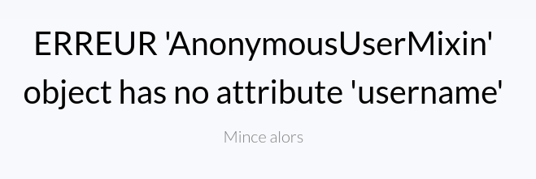
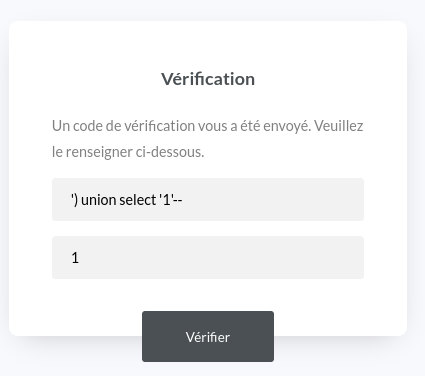

# Le Gorfou 42 - Web - Moyen

### Énoncé

Voici le site web du journal de football LE GORFOU 42 ! Il est tout neuf, dispose de quelques articles intéressants et, est super sécurisé... non ?


https://le-gorfou-42.challenges.404ctf.fr
---

### Résolution

On nous met au défi de trouver une faille de sécurité sur le site internet donné en lien dans l’énoncé. On y trouve une page d’accueil très sommaire, une page listant des "articles" (un titre et une phrase, aucun lien cliquable), ainsi qu’une page de connexion.

La page `Articles` et `Connexion` possèdent un formulaire. Le premier réflexe est de soumettre le formulaire avec une simple quote, mais aucun message d’erreur, donc à priori pas d’injection SQL. Même résultat avec des balises HTML, les pages ne semblent pas non plus vulnérables à une quelconque faille XSS. Si on tente d’énumérer (à la main !) des pages existantes, mais non rendues publiques, on fait quelques trouvailles :

- une page `/admin`



Elle nous permet d'apprendre que le backend est codé en python, à l’aide du micro framework Flask. De plus, elle n’est protégée par aucune restriction de login. La seule chose qui nous empêche d’y accéder est le fait que dans Flask, un utilisateur anonyme (non authentifié) ne possède pas de champ `username`.
Ce que le back fait probablement à cet endroit est quelque chose comme ceci :

```python
if user.username == "admin_username":
    # do something for admin user
```

Ce qui provoque cette erreur, étant donné que cet attribut n’existe pas sur un utilisateur non authentifié.

- une page `/logout`


On constate au passage que toutes les exceptions levées par le back sont, dans le plus grand des calme, affichées à l’utilisateur...

- une page d’erreur 404, avec le formulaire de recherche de la page des articles


Aucun fichier de configuration ne leak (`.git`, `README.md`, etc...). L’endpoint `/console` n’est pas non plus accessible. 

La page admin n’étant pas protégée, à partir de cet instant le seul angle d’attaque que j’envisage est celui de forger un cookie de session, afin que le backend puisse manipuler un objet `user` authentifié, passer la condition évoquée ci-dessus et pouvoir accéder au contenu de la page. J’ai passé plusieurs heures sur cette fausse piste en essayant de bruteforcer (en local) une potentielle secret key faiblarde, et autre vaines tentatives de crafter un cookie de session. (Quand on nous dit que bruteforcer n’est pas nécessaire...)

Une fois convaincu que mon angle d’attaque est mauvais, je repasse au peigne fin toute la surface d’attaque du site web, et je remarque ceci en soumettant le formulaire de recherche de la page d’articles, et le formulaire de recherche de la page 404:

La requête effectuée depuis la page `Articles` :


La requête effectuée depuis la page générique `404` :


On tape sur deux routes différentes ! Pensant que c’était un formulaire identique, je n’avais pas testé ce dernier. Et si on soumet une simple quote... On a trouvé la faille:

```Une erreur est survenue : unrecognized token: "'" ```

Une injection SQL. Après quelques essais, je parviens à déterminer que l’on a à faire une DB SQlite et que le back attend un retour avec deux colonnes, la première étant un int (l’id de l’article, peut-être ?), et la seconde une string (le titre et le contenu de l’article). 
À partir de là, on peut se faire plaisir et énumérer tout le contenu de la DB.

Les tables:


Le schéma de la seule table qui nous intéresse, la table users :


Le dump de la table users :


Avec le login/password de l’admin en poche, on se dirige vers le formulaire de connexion, pour tomber sur une page de double authentification :


Si on tente une SQLi dans ce nouveau formulaire, on constate une faille dans l’input du login, mais pas dans celui du code de vérification. Le message d’erreur de l’input nom d’utilisateur est différent du précédent :

```Une erreur est survenue : unrecognized token: "''')" ```

Il faut comprendre ici deux choses: l’username est passé en paramètre d’une requête SQL, mais le résultat de celle-ci est passée en paramètre d’une fonction SQlite. D’où la parenthèse fermante attendue. En tombant sur cette page de TFA, j’ai tenté de trouver un endpoint qui aurait un quelconque rapport avec une génération d’OTP, mais sans succès. Le code attendu doit donc être généré autrement... à la volée par cette fonction peut-être ? Si c’est le cas, ça risque d’être compliqué de l’extraire pour le soumettre dans le même temps. D’autant que seul l’input username est vulnérable.

Comment faire alors ? Imaginons ce que peut faire le back à la soumission de ce formulaire, quelque chose comme ça me semble pertinent :

```python
if cursor.execute(f"SELECT CUSTOM_FUNCTION_FOR_OTP(SELECT Xx_US3RNAM3_xX FROM Xx_US3RS_xX WHERE Xx_US3RNAM3_xX = '{form.username}')")[0] == form.code:
    # validate user authentication
```

Le back calcul l’otp à l’aide de la donnée du champ nom utilisateur (ou du mot de passe, ou des deux concaténés, ou n’importe quoi d’autre, ça n’est pas très important ici), et la compare avec l’otp rentré par l’utilisateur. Si les deux correspondent, l’utilisateur est authentifié. Donc... tout ce que l’on a à faire, c’est se débrouiller pour que la valeur rentrée dans le champ `Code` soit égale à celle rentrée dans le champ `Votre nom d’utilisateur`. Facile !



Les simples quotes autour de notre valeur arbitraire dans le champ utilisateur sont importantes ! Tout ce que l’on passe dans le formulaire est casté en string côté back, donc le `1` du champ `Code` deviendra un `'1'` côté back !
Sans ça, le back comparerait `1 == '1'` qui vaut `False` !

On nous propose désormais d’accéder au panneau d’administration


Flag !
