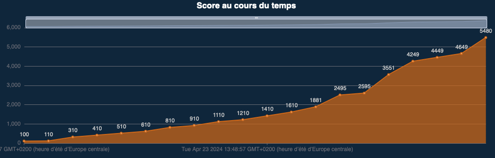

# 404CTF 2024

| Challenge  | Catégorie | Difficulté | Points |
|:-------------:|:-------------:|:-------------:|:-------------:|
| Discord | Divers | Intro | 10 |
| Bienvenue | Divers | Intro | 100 |
| Bébé nageur | Cryptanalyse | Intro | 100 |
| Le petit bain | Cryptanalyse | Facile | 200 |
| Poor Random Number Generator 1/2 | Cryptanalyse | Facile | 271 |
| [Plongeon Rapide Super Artistique](PRSA/README.md) | Cryptanalyse | Moyen | 698 |
| [Poor Random Number Generator 2/2](<Poor Random Number Generator 2\2/README.md>) | Cryptanalyse | Moyen | 956 |
| Vous êtes en RETARD | Web | Intro | 100 |
| Le match du siècle 1/2 | Web | Intro | 100 |
| Exploit Mag | Web | Facile | 200 |
| Le match du siècle 2/2 | Web | Moyen | 200 |
| [LE GORFOU 42](<Le Gorfou 42/README.md>) | Web | Moyen | 614 |
| Le tir aux logs | Forensic | Intro | 100 |
| Coup de circuit 1/3 | Forensic | Facile | 200 |
| L’absence | Stéganographie | Intro | 100 |
| Regarder en stéréo | Stéganographie | Facile | 200 |
| Légende | OSINT | Intro | 100 |
| Not on my watch | OSINT | Facile | 200 |
| Coup de circuit 2/3 | OSINT | Facile | 200 |
| That Escalated Quickly | OSINT | Moyen | 831 |

Score total : 5480

Classement : 156 / 3271

