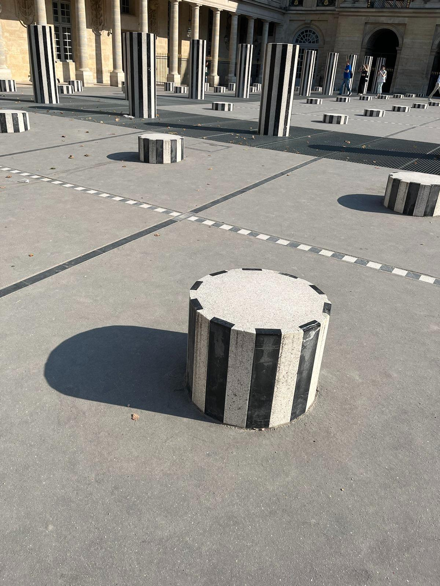

# Chronolocalisation

### Challenge description

Among all the posts published by Réinformation Lucide, the pictures are particularly important because, according to our sources, they were taken by the administrators of the group. Find the date and place when this picture was taken (in a 1 hour interval).

Flag format : PLAB{dd/mm/yyyy;11:00-12:00}

### Solution

This challenge was probably the one i most enjoyed. It's by far the most creative. Thanks Predictalab for this !

We are given this picture:



posted on facebook the 9th Jun 2023, with this message:

```
If you pass through the center of Paris, as I did three days ago, you'll be able to see this famous "artistic" installation. But do you know its true history?
In the 18th century, an influential secret group, the Illuminati, infiltrated Parisian artistic circles. They collaborated (and the word is apt) with renowned artists to disseminate coded messages through their works of art.
Each element of the columns is said to have a hidden meaning. The black and white stripes that characterize the columns represent the duality of the world we live in, where good and evil coexist. The varying heights of the columns form a cryptic pattern that links the various esoteric symbols scattered across Paris, indicating important places in the city that are linked to this occult group.
Yet more irrefutable proof of the Illuminati's infiltration of regal power.
```

We are asked to find out when this picture was tooked, including the hour !

Regarding the date, the author mentions he was in Paris three days ago, and the message was posted on 9th June. Which give us the 6th June.
But how are we supposed to get the hour ?

Our first instinct would be to check the EXIF data, let's give it a try:

```
$ exiftool 347248640_113605011757033_6215024108866734539_n.jpg
ExifTool Version Number         : 12.57
File Name                       : 347248640_113605011757033_6215024108866734539_n.jpg
Directory                       : .
File Size                       : 382 kB
File Modification Date/Time     : 2024:08:13 12:11:11+02:00
File Access Date/Time           : 2024:08:13 12:16:45+02:00
File Inode Change Date/Time     : 2024:08:13 12:11:11+02:00
File Permissions                : -rw-r--r--
File Type                       : JPEG
File Type Extension             : jpg
MIME Type                       : image/jpeg
JFIF Version                    : 1.01
Resolution Unit                 : None
X Resolution                    : 1
Y Resolution                    : 1
Profile CMM Type                : Little CMS
Profile Version                 : 2.1.0
Profile Class                   : Display Device Profile
Color Space Data                : RGB
Profile Connection Space        : XYZ
Profile Date Time               : 2018:03:20 09:14:29
Profile File Signature          : acsp
Primary Platform                : Microsoft Corporation
CMM Flags                       : Not Embedded, Independent
Device Manufacturer             : Unknown (saws)
Device Model                    : ctrl
Device Attributes               : Reflective, Glossy, Positive, Color
Rendering Intent                : Perceptual
Connection Space Illuminant     : 0.9642 1 0.82491
Profile Creator                 : Unknown (hand)
Profile ID                      : 9d91003d4080b03d40742c819ea5228e
Profile Description             : uRGB
Profile Copyright               : CC0
Media White Point               : 0.9505 1 1.089
Red Matrix Column               : 0.43604 0.22244 0.0139
Green Matrix Column             : 0.3851 0.71693 0.09708
Blue Matrix Column              : 0.14307 0.06062 0.71393
Red Tone Reproduction Curve     : (Binary data 96 bytes, use -b option to extract)
Green Tone Reproduction Curve   : (Binary data 96 bytes, use -b option to extract)
Blue Tone Reproduction Curve    : (Binary data 96 bytes, use -b option to extract)
Image Width                     : 1200
Image Height                    : 1600
Encoding Process                : Baseline DCT, Huffman coding
Bits Per Sample                 : 8
Color Components                : 3
Y Cb Cr Sub Sampling            : YCbCr4:2:0 (2 2)
Image Size                      : 1200x1600
Megapixels                      : 1.9
```

Not so much of a help ! Of course, the author took care of removing any compromising data.

Looking again at the picture, we can see we have enhanced shadows. The higher pillars are almost 2 meters high. Of course, we could deduce the hour using the length of the shadows on the ground, but we don't have that information.
However, you might notice that the length shadows in the background are almost the size of the space between pillars. If this place is as famous as the author said, we might find those details online, and thus shadows sizes !

Using a reverse search engine, we quickly find that this place is named `Les Deux Plateaux` or `Colonnes de Buren`. It as his own wikipedia page.
The space every column is the same all over the place, 3,19 meters. We have the high of pillars, the size of the shadows, now we need their orientation regarding cardinal directions. 

By taking some pictures from slighly different angles, we can deduce the cardinal direction of the shadows:


Considering that the satellite view is north oriented (the north being the upper of the picture), and that the shadows are almost parallel to the gratings, their cardinal direction is almost plain west.
This means the sun was in the east. 

We have:

- The date, 6th June
- A precise location (Paris)
- The pillars high (~ 2 meters)
- The length of the shadows (~ 3 meters)
- Their orientation (Almost plain West)

We have all it takes to use a tool like SunCalc to compute the hour.


The only hour that match the shadows orientation and his length given the pillars size is around 18h !

So our interval is 18h00-19h00

Flag:

PLAB{06/06/2023;18:00-19:00}

