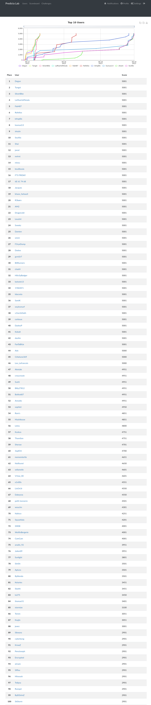

# Predictalab CTF 2023

Predictalab CTF was the first CTF by Predictalab. 
It was a full OSINT CTF and an opportunity to improve my skills in this category.
Please find below with a ~~bit of~~ huge delay write ups for challenges i enjoyed the most.

Score total : 5001

Classement : 25 / 1229 

| Challenge  | Points | Résolutions |
|:-------------:|:-------------:|:-------------:|
| Félicitations ! | 300 | 70 |
| Évènement | 300 | 78 |
| Message | 500 | 80 |
| Train | 400 | 400 |
| Rendez-vous | 600 | 103 |
| Cible | 600 | 106 |
| Annonce | 300 | 138 |
| Opération | 300 | 166 |
| Acolyte | 400 | 228 |
| Acolyte 2 | 200 | 279 |
| Association | 200 | 420 |
| Pseudonyme | 100 | 563 |
| [Chronolocalisation](Chronolocalisation/README.md) | 400 | 340 |
| Géolocalisation | 300 | 314 |
| Slogan | 100 | 750 |
| Introduction | 1 | 1229 |

