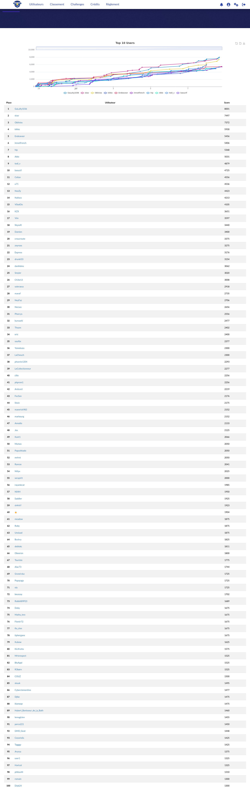

# Shutlock CTF 2024

Le ShutlockCTF 2024 est la première édition d’un CTF «jeopardy» organisé par la DGSI en collaboration
avec des étudiants de l’école EPITA.

Score total : 3400 (+50 pour le feedback)

Classement : 19 / 621

| Challenge  | Catégorie | Points | Résolutions |
|:-------------:|:-------------:|:-------------:|:-------------:|
| Le Mac KB | Osint | 125 | 348 |
| Le Quêteur Démasqué | Osint | 125 | 72 |
| Globecodeur à la Conquête du Secret | Osint | 100 | 100 |
| Operation Gear Grinder 0/12 | Osint | 100 | 496 |
| Operation Gear Grinder 1/12 | Osint | 100 | 281 |
| Operation Gear Grinder 2/12 | Osint | 100 | 197 |
| Operation Gear Grinder 3/12 | Osint | 100 | 168 |
| Operation Gear Grinder 4/12 | Osint | 100 | 97 |
| Operation Gear Grinder 5/12 | Osint | 100 | 95 |
| Operation Gear Grinder 6/12 | Osint | 100 | 92 |
| Operation Gear Grinder 7/12 | Osint | 100 | 85 |
| Operation Gear Grinder 8/12 | Osint | 100 | 82 |
| Operation Gear Grinder 9/12 | Osint | 100 | 74 |
| [Une clé USB qui ouvre des portes](<cle usb/README.md>)| Reverse | 125 | 45 |
| Molimg Classifier | Misc | 125 | 54 |
| Familles Complexes | Misc | 100 | 71 |
| Il était une fois un samurai | Misc | 100 | 120 |
| [Murder Scene](<Murder Scene/README.md>) | Misc | 456 | 21 |
| Perquisition | Forensic | 125 | 79 |
| Enquête sur le phishing des JO : Retracer l'attaque 1/2 | Forensic | 152 | 57 |
| [Enquête sur le phishing des JO : Retracer l'attaque 2/2](<Enquête JO 2-2/README.md>) | Forensic | 442 | 24 |
| OTPasVraiment | Crypto | 125 | 46 |
| Un fanfaron pas très smart... | Crypto | 125 | 126 |
| Qui a laissé trainer son bloc note ? | Web | 125 | 204 |

