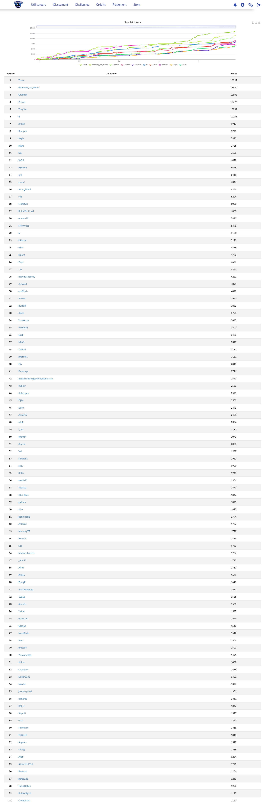

# Shutlock CTF 2026

Le ShutlockCTF 2026 était la troisème édition d’un CTF «jeopardy» organisé par la DGSI en collaboration
avec des étudiants de l’école EPITA.

[C'était la seconde à laquelle je participait](../shutlock_ctf/README.md)

Score total : 4879 (+50 for feedback)

Classement: 24 / 397 

| Challenge  | Categorie | Points | Résolutions |
|:-------------:|:-------------:|:-------------:|:-------------:|
| [E.S.T.H.E.R](esther/README.md) | Web | 493 | 8 |
| Cache-Cache | Web | 454 | 18 |
| Pomme de reinette et pomme d'API | Web | 347 | 32 |
| Hisser les drapeaux | Web | 293 | 37 |
| Liaisons dangereuses | Web | 100 | 66 |
| [Substix](substix/README.md) | Forensic | 490 | 9 |
| SpyDroid2 | Forensic | 469 | 15 |
| Indice 7 | Forensic | 50 | 88 |
| speedcoding | Dev | 490 | 9 |
| Indice 6 | Dev | 50 | 69 |
| L'IArchiviste | IA | 493 | 8 |
| Indice 2 | IA | 50 | 108 |
| DIANE | MISC | 484 | 11 |
| Archives à couches multiples (1/3) | Système | 100 | 146 |
| Archives à couches multiples (2/3) | Système | 100 | 54 |
| Paper Trail | Network | 116 | 50 |
| Dérive Aérienne | Network | 100 | 114 |
| Opération Chioné 1/5 | OSINT | 100 | 308 |
| Indice 8 | OSINT | 50 | 115 |

